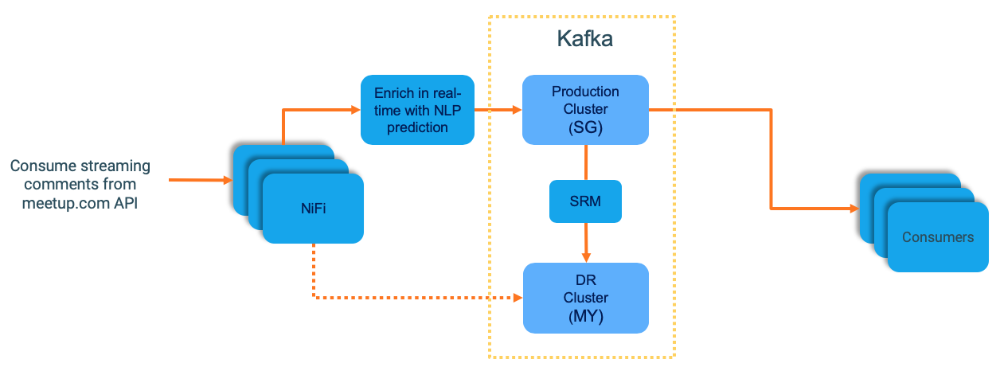

# cdp-streaming-demo
The repository contains a simple setup of Cloudera stack components to demonstrate a simple streaming use-case.

<b>The use-case looks like this:

* Clone this repository to /root & run the below as the root user
* Setup the environment for the coreNLP project to run & download spark dependency jar files from maven 
`/root/cdp-streaming-demo/scripts/00_config_demo.sh`
* Run the NLP application `/root/workflow-deployment/start_nlp_engine.sh`

# Setup SRM
- Configure SRM as below

# Setup SMM
- Enable `streams.replication.manager.configure`
- Configure SMM as below

# Setup Nifi on the SG cluster
* Import Nifi Template: nifi-template/meetup-stream.xml
* Go to `ConnectWebSocket` processor and enable `JettyWebSocketClient`. This will enable connecting to meetup.com and will stream messages
* Go to `UpdateHTTP` processor and update the `Remote URL` to point to your private IP
    * Example: `http://10.0.1.100:9999/?properties=%7B%22annotators%22%3A%22sentiment%22%2C%22outputFormat%22%3A%22json%22%7D`
* Go to “PublishKafka_2_0” processor and update the “kafka Brokers” property to point to the private IP
    * Example: `10.0.1.100:9092`
* Start all processors and give it a few mins for messages to arrive and land into Kafka

# Enable replication
- Whitelist replication of the kafka topic “meetup-data” use the SRM CLI: 
`/root/cdp-streaming-demo/scripts/kafka-helpers/srm-replicate.sh meetup-data`

# Validate if SRM shows data flowing through to DR site (MY)

This project is based on excerpts from the CDH based workshop: https://github.com/rajatrakesh/CDF-CDH-Workshop/
